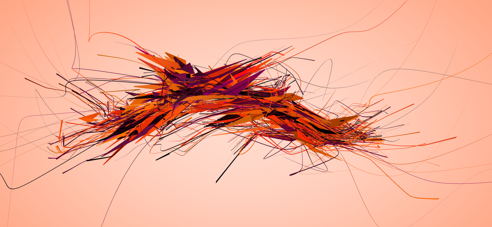

# Aesthetic Engine 2

AE2 is simultaneously a web browser, a generative data sculpture, and a shape-shifting painting. Created as an attempt of exposing the complexity of scaffolding supporting the user-facing elements of the World Wide Web, it serves no purpose.

Each web page is rendered using predefined rules for different groups of HTML tags. The content which is visible to users in conventional web browsers (paragraphs, images, etc) is rendered using the thickest shapes. Scaffolding around visible content – all of the “invisible” internal stuff – is rendered using thinner strands escaping from the middle of the structure. Javascript code, CSS files, and all other externally loaded resources are rendered as twisting lines wrapping themselves around the structure. Lastly, the webpage’s code is scraped for all outgoing links (URLs) and each of them is rendered as a long line escaping from the structure outward, therefore visualizing the “connectedness” of the page.

Browsing is guided – at startup, one of two predefined websites is loaded. When a user decides to go to the next page (by pressing Space or Enter), she is taken to a webpage whose URL was chosen at random from all of the URLs scraped from the current webpage. That way, she is slowly “crawling the web”. There is no going back.

## Usage

[Download a released build](https://github.com/BRUTALISM/BRU-9/releases) or build your own – see instructions below.

Inside the app, use Space or Enter to move to the next web page. Click and drag to look around, WASD to move.

**Hint** – On Mac OS, you can generate desktop wallpapers by making the app fullscreen and then using the standard screenshot shortcut `Cmd + Shift + 3` to save a snapshot of the entire screen to your desktop as an image.

## Building and playing around

On Mac/Linux:

    scripts/setup.sh

On Windows:

    script\setup.bat

This will install the node dependencies for the project, along with grunt and bower and will also run `grunt setup`.

To get an interactive development environment run:

    lein figwheel

In another terminal window, launch the electron app:

    grunt launch

You can edit any of the ClojureScript source files and the changes should show
up in the electron app without the need to re-launch. If you feel like experimenting, `src/bru_9/scenes/main.cljs` should be your point of entry.

## Dependencies

Node dependencies are in `package.json` file. Bower dependencies are in
`bower.json` file. Clojure/ClojureScript dependencies are in `project.clj`.

## Creating a build for release

To create a Windows build from a non-Windows platform, please install `wine`. On
OS X, an easy option is using homebrew.

On Windows before doing a production build, please edit the
`scripts/build-windows-exe.nsi` file. The file is the script for creating the
NSIS based setup file.

On Mac OSX, please edit the variables for the plist in `release-mac` task in
`Gruntfile.js`.

Using [`electron-packager`](https://github.com/maxogden/electron-packager), we
are able to create a directory which has OS executables (.app, .exe etc) running
from any platform.

If NSIS is available on the path, a further setup executable will be created for
Windows. Further, if the release command is run from a OS X machine, a DMG file
will be created.

To create the release on OS X:

    grunt cljsbuild-prod
    grunt prepare-release
    grunt release-mac --force

This will create the directories in the `builds` folder.

Note: you will need to be on OSX to create a DMG file and on Windows to create
the setup .exe file.

## License

Copyright © 2016 BRUTALISM

Distributed under the [Creative Commons Attribution-NonCommercial-ShareAlike 4.0
International license](http://creativecommons.org/licenses/by-nc-sa/4.0/).
See LICENSE for details.
